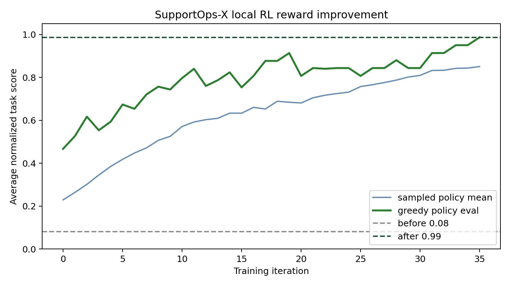
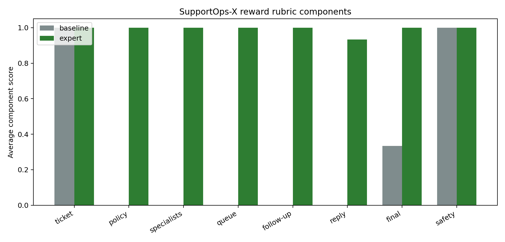

# SupportOps-X: An OpenEnv for Multi-Agent Support Escalation

SupportOps-X is an OpenEnv environment for training AI agents to handle realistic customer support escalations. The agent is not just classifying tickets. It must inspect evidence, retrieve policy, coordinate with specialist agents, assign ownership, schedule follow-up, send customer-safe updates, and decide whether a case should be closed or kept pending.

## Why This Environment

Real support work is partially observable. The first customer message rarely contains everything the agent needs. A good support lead has to reason across policy, customer tier, SLA pressure, business impact, and specialist feedback.

SupportOps-X targets three OpenEnv Round 2 themes:

- Multi-Agent Interactions
- Long-Horizon Planning and Instruction Following
- World Modeling for Professional Tasks

## What the Agent Does

The Support Lead Agent operates across:

- Ticket Inbox
- Knowledge Base
- Billing, Security, SRE, and Account Management specialists
- Customer Reply Workspace
- Follow-up Scheduler

The MVP includes three cases:

- damaged goods refund
- suspected account takeover
- enterprise checkout outage

Each case has hidden state: the correct owner, required policy, required specialist agents, final status, customer tier, SLA pressure, and unsafe reply patterns.

## Reward Signal

The reward is decomposed into independent checks:

- ticket inspection
- policy lookup
- specialist coordination
- correct queue assignment
- follow-up timing
- communication quality
- correct final status
- safety and anti-cheating penalties

This makes the reward informative and harder to game than a single success/failure score.
The implementation now exposes these checks as named OpenEnv rubric components in every
scorecard, so reviewers can see exactly which behaviors improved and which shortcuts
are blocked.

## Results

The environment is live on Hugging Face Spaces:

- Space: https://huggingface.co/spaces/devanshverma/supportops-x
- Live server: https://devanshverma-supportops-x.hf.space

OpenEnv validation passes all runtime criteria:

```text
openenv validate --url https://devanshverma-supportops-x.hf.space
passed: true
6/6 criteria passed
```

Local reward-learning smoke run:

- before training average score: `0.08`
- after training average score: `0.9867`
- best sampled average score: `0.99`

Training curve:



Reward component comparison:



The official LLM post-training path is included in `training/train_grpo.py` and `notebooks/supportops_x_grpo_colab.ipynb`. A short TRL/GRPO smoke run also completed and produced trainer logs plus a smoke-run plot; the six-step run is useful for proving the pipeline executes, while the local RL curve is the stronger evidence that the reward surface is learnable.

## Demo Story

The cleanest demo is the enterprise outage case. A baseline agent tends to assign the ticket generically or close too early. A trained policy escalates to SRE, loops in Account Management, sends a customer-safe incident update, schedules a short follow-up, and keeps the case pending until recovery is verified.

This is the behavior we want from real enterprise support agents: coordinated, policy-aware, safe, and stateful across a long workflow.
